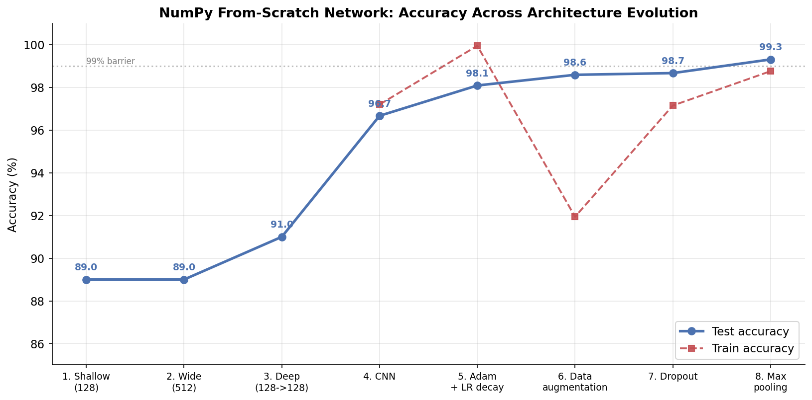
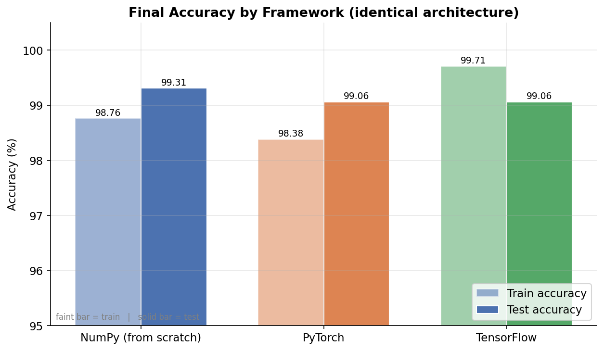
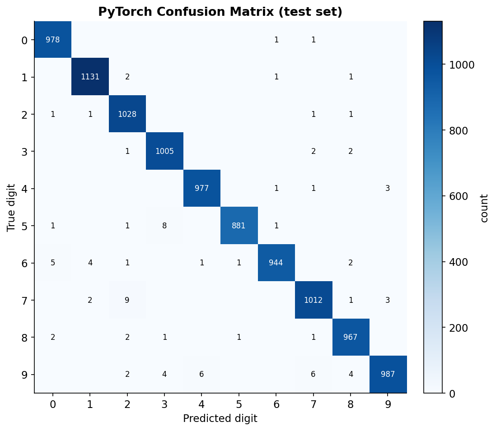
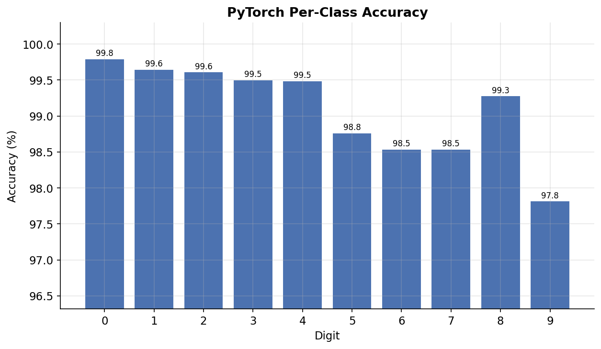
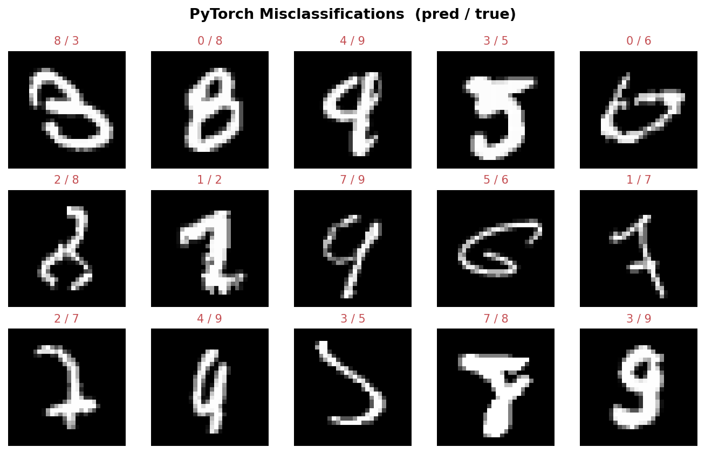
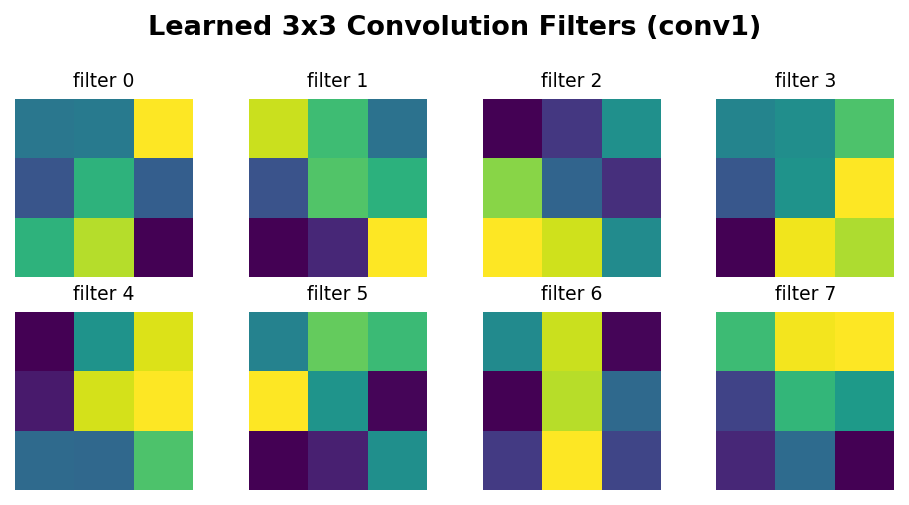

# NumPy Deep Learning: From Scratch

This project is a handwritten digit recognition neural network built entirely from scratch using pure Python and NumPy. The project also builds the exact same network architecture using PyTorch and Tensorflow to compare and learn both frameworks. The goal of this project was to understand the underlying calculus, linear algebra, and architecture of machine learning before using frameworks like TensorFlow or PyTorch where the higher level of the language's make it harder to understand the internal logic.

## The Journey & Architecture Evolution

This network was built iteratively, starting from a basic mathematical foundation and evolving into a deep learning architecture.

### Numpy Implementation
### Step 1: The Shallow Foundation
* **Architecture:** 1 Hidden Layer (128 nodes).
* **Details:** Implemented the core forward pass, backpropagation, and Gradient Descent algorithms. Flattened $28 \times 28$ pixel images into a 784-element 1D array.
* **Result:** Achieved **~89% accuracy** on unseen test data. Proved the math worked, but hit a clear performance ceiling.

### Step 2: Scaling Width
* **Architecture:** 1 Hidden Layer (512 nodes).
* **Details:** Increased the "memory" of the network to see if a wider layer could break the 90% barrier. 
* **Result:** Accuracy remained stagnant at **~89%**. Learned that simply adding capacity doesn't solve fundamental structural limitations; the network became better at memorizing but not necessarily better at generalizing the core concepts of digits.

### Step 3: Going Deep
* **Architecture:** 2 Hidden Layers (128 nodes $\rightarrow$ 128 nodes).
* **Details:** Transitioned from a Multi-Layer Perceptron to true Deep Learning. 
    * Implemented **He Initialization** (`np.random.randn(...) * np.sqrt(2.0 / inputs)`) to prevent variance explosion and dead neurons across multiple layers.
    * Derived and applied the **Chain Rule** twice to pull error gradients back through the middle layer.
* **Result:** Broke the barrier and achieved **~91% Test Accuracy**. The deep architecture successfully learned hierarchical, abstract representations of the numbers.

### Step 4
* **Architecture:** CNN (8 Filters $3 \times 3 \rightarrow$ Flatten $\rightarrow$ 128 nodes $\rightarrow$ 128 nodes $\rightarrow$ 10 nodes).
* **Details:** Cured the network's "Spatial Blindness" by replacing the raw pixel inputs with a 2D mathematical "magnifying glass."
    * Implemented Convolutional Filters to scan the image for spatial features (edges, loops, curves) before passing them to the dense layers.
    * Developed vectorized im2col (Image to Column) math to convert slow, nested sliding-window loops into high-speed matrix multiplications.
    * Integrated CuPy for GPU acceleration and optimized RAM usage, cutting training time from an estimated year down to minutes.
* **Result:** Achieved 97.20% Training Accuracy and 96.67% Test Accuracy. The network successfully reshaped its loss landscape, finding a much deeper local minimum by learning actual geometric features instead of memorizing pixel coordinates.

### Step 5: Adam Optimizer & Learning Rate Decay
* **Architecture:** Same network with Adam optimizer instead of SGD.
* **Details:** In this phase, we upgraded the learning engine from standard Gradient Descent to a custom-built Adam Optimizer. By tracking both the exponentially weighted moving average of the gradients (momentum/velocity) and the squared gradients (friction), the network dynamically customizes the learning rate for every individual weight and bias. To prevent overshooting at the absolute bottom of the loss valley, we also implemented Learning Rate Step Decay to progressively shrink the step size during the final epochs.
* **Result:** Achieved 99.95% Training Accuracy and 98.09% Test Accuracy. This performance effectively hits the mathematical ceiling for a standard Convolutional Neural Network architecture on this dataset, demonstrating robust feature extraction with only a minor generalization gap left to solve via regularization.

### Step 6: Data Augmentation
* **Architecture:** Same network as Step 5 with data augmentation.
* **Details:** In this phase, we tackled overfitting by implementing a custom, purely mathematical data augmentation engine. To prevent the network from memorizing static pixel coordinates, we introduced randomized horizontal and vertical pixel shifts (Translations) to the batches immediately before the forward pass. Using independent X and Y matrix slicing and coordinate logic, we dynamically shifted the matrices and padded them with zero-value (black) pixels. Because the images are augmented "on-the-fly," the network never sees the exact same image twice, forcing it to learn universal geometric shapes rather than positional anomalies.
* **Result:** Achieved 91.94% Training Accuracy and 98.59% Test Accuracy. This solved the problem of overfitting which means that the network no longer memorises the data set but actually learning on it. The higher testing accuracy is the byproduct of this learning.

### Step 7: Dropout Regularization
* **Architecture:** Same network as Step 6 but dropping 20% of first hidden layer's neurons.
* **Details:** To further combat overfitting and prevent "lazy" neurons from relying heavily on specific weights, we implemented Inverted Dropout from scratch. By generating a random boolean mask during the forward pass, we intentionally deactivated a percentage of neurons in the hidden layers. The surviving neurons were mathematically scaled up by the keep probability to maintain signal balance. This exact mask was cached and used during backpropagation to freeze the gradients for the "dead" neurons, ensuring they were not penalized or rewarded for work they didn't do. During training we applied a 20% dropout to both the first and second dense layers. That caused testing accuracy to drop. Learned that applying dropout consecutively especially on smaller layers suffocates the network by destroying a large amount of the signal that was already fragmented causing the network to underfit the data.
* **Results:** Achieved 97.15% Training Accuracy and 98.67% Testing Accuracy. The slight increase in testing accuracy proved that the dropout regularization of one layer is working properly. 

### Step 8: Max Pooling
* **Architecture:** Added a Max Pooling layer after the convolutional one.
* **Details:** The final architectural upgrade is the Max Pooling layer, which acts as a purely mathematical spatial crusher to isolate dominant features, grant translation invariance, and drastically reduce the parameter count for the upcoming Dense layers. In the forward pass, the flat memory of the 4D Convolutional output is carefully reshaped into 6 dimensions and transposed to physically group pixels into true spatial blocks, where the highest value is extracted and the rest are discarded. During the backward pass, the layer executes a "stretch and strike" maneuver, utilizing np.repeat to inflate the shrunken error gradient back to its original dimensions before multiplying it element-wise against the saved mask. This instantly zeroes out the error for the discarded pixels while perfectly routing the gradient back to the original maximum coordinates, securing the unbroken mathematical chain of your Convolutional Neural Network.
* **Results:** Achieved 98.76% Training Accuracy and 99.31% Testing Accuracy. The network correctly used Max Pooling to reach it's ultimate potential breaking the 99+% testing accuracy. Max Pooling also slightly increased Training Accuracy.

### PyTorch Implementation
* **Architecture:** The network has the exact same architecture as the numpy version.
* **Details:** This section of the project transitions the custom neural network into a fully optimized PyTorch implementation. By leveraging PyTorch's nn.Module and Autograd engine, the network achieves significantly faster training times and exceptional accuracy through GPU acceleration and highly optimized backend operations.

* **Performance:**
Training Accuracy: 98.38%

Testing Accuracy: 99.06%

Key Features & Optimizations
Native GPU Augmentation: Custom data augmentation (random coordinate shifting) is implemented using pure PyTorch tensors. This allows the augmentation to run dynamically per batch entirely on the GPU (CUDA), completely eliminating the CPU-GPU synchronization bottleneck.

Optimized Loss Calculation: The training loop utilizes PyTorch's CrossEntropyLoss combined with 1D class indices (torch.argmax) rather than raw 2D one-hot encoded arrays. This exploits PyTorch's internal C++ optimizations to bypass zero-multiplication, saving memory and CPU cycles.

Dynamic Data Loading: Implements TensorDataset and DataLoader for efficient VRAM batching and perfect epoch-level shuffling, forcing the network to learn true translation invariance rather than memorizing batch orders.

Strict Evaluation Protocol: The testing pipeline cleanly separates training logic from evaluation. It utilizes model.eval() to lock the network state and processes the raw, un-augmented test dataset inside a torch.no_grad() block to eliminate gradient memory overhead and reveal true real-world accuracy.

### Tensorflow Implementation
* **Architecture:** The network has the exact same architecture as the numpy version.
* **Details:** The model demonstrates high precision and generalization when evaluated on standard data.

* **Performance:**
Training Accuracy: 99.71%
Testing Accuracy: 99.06%

Rather than relying on TensorFlow's high-level model.fit() API, this implementation utilizes a fully custom training architecture. This approach provides granular control over the forward pass, gradient calculations, and hardware utilization, closely mirroring the flexibility typically associated with PyTorch.

Key Architectural Features
Object-Oriented Model Subclassing:
The network is built by subclassing tf.keras.Model. All layers (Convolutions, Max Pooling, Flattening, and Dense layers) are explicitly instantiated in the __init__ method, and the forward pass is manually routed through the call() method.

Custom Training Loop & GradientTape:
Training is executed via a raw Python for loop. Backpropagation is handled manually using tf.GradientTape to record operations, calculate gradients, and apply them via the optimizer. This allows for absolute control over the mathematical execution of each step.

Graph Compilation (@tf.function):
To bypass the overhead of standard Python eager execution, the core training and testing steps are wrapped with the @tf.function decorator. This triggers XLA (Accelerated Linear Algebra) compilation, converting the Python logic into a static, highly optimized C++ execution graph. This drastically accelerates matrix multiplications and allows the CPU/GPU to utilize advanced vector extensions.

Optimized Data Pipeline:
The data stream is managed using the tf.data.Dataset API. To prevent GPU/CPU starvation during training, the pipeline implements asynchronous prefetching (tf.data.AUTOTUNE), ensuring that the next batch of data is loaded and augmented in the background while the current batch is actively computing.

Cross-Framework Shape Compatibility:
To maintain compatibility with PyTorch-style datasets, the network explicitly configures all convolutional and pooling layers to process spatial data using the channels_first data format (Batch, Channels, Height, Width), overriding TensorFlow's native channels_last default.

Dynamic Batch Sizing:
The architecture natively handles irregular batch sizes at the end of epochs. Instead of relying on static Python .shape calls, it dynamically calculates batch dimensions during runtime within the compiled C++ graph using tf.shape().

## Results & Visualizations

All figures are generated by the scripts in [plots/](plots/) (see [plots/README.md](plots/README.md) for how to regenerate them).

### Accuracy progression (NumPy from scratch)
The 99% test-accuracy barrier was crossed step by step as the architecture evolved from a shallow MLP to a CNN with Adam, augmentation, dropout, and max pooling.

### Final accuracy by framework
Same architecture, three implementations. TensorFlow overfits the most (widest train/test gap); the NumPy model generalizes best thanks to on-the-fly augmentation and dropout.

### Training curves
Per-epoch loss and training accuracy for all three frameworks. These are produced by `plots/plot_curves.py` after running each `train.py` once (which now logs metrics to `metrics/history_<framework>.json`).

<!--  -->
<!--  -->

### Model diagnostics (PyTorch, from saved weights — 99.11% test)
Generated by inference only, no retraining required.

| Confusion matrix | Per-class accuracy |
|---|---|
|  |  |

The classic MNIST confusions dominate the off-diagonal (9→4, 7→2, 5→3), and digit **9** is the hardest class (97.8%).

| Misclassified samples | Learned conv filters |
|---|---|
|  |  |

Most misclassifications are genuinely ambiguous handwriting; the eight learned 3×3 filters show the edge/stroke detectors the CNN discovered on its own.

## Key Technical Learnings
* **The Math is the Engine:** Fully translated the Chain Rule, Cross-Entropy Loss, Softmax, and ReLU derivatives into matrix operations.
* **Dimensionality:** Mastered matrix alignment—ensuring weights, biases, and dot products flow seamlessly backward and forward.
* **Optimization vs. Capacity:** Learned that falling into local minima of the loss function cannot always be fixed by throwing more nodes at the problem.
* **Spacial Invariance:** Learned how Parameter Sharing (using the same $3 \times 3$ filter weights across the whole image) allows the model to recognize a digit regardless of its position.
* **Hardware & Memory Management:** Discovered that software performance is heavily dictated by memory leaks, garbage collection, and how efficiently data is batched to the GPU.

### Framework Comparison & Developer Experience
Building this architecture across three distinct frameworks—NumPy, PyTorch, and TensorFlow—provided a unique, comparative look at how different ecosystems handle deep learning paradigms. Below is a breakdown of the developer experience for each.

## 1. NumPy: The Educational Foundation
Writing a neural network from scratch in pure NumPy was the most complex but undeniably the most valuable implementation for foundational learning.

Pros: It forces a deep, uncompromising understanding of the underlying mathematics, linear algebra, and calculus that power deep learning. Because the code is entirely transparent, troubleshooting mathematical errors is straightforward. You know exactly what every matrix multiplication is doing.

Cons: The lack of abstraction means you must manually maintain the forward-pass cache for backpropagation, which drastically increases codebase size and complexity. Additionally, standard NumPy lacks native CUDA support, restricting training to the CPU.

## 2. PyTorch: The Developer Favorite
Overall, PyTorch provided the most pleasant and frictionless developer experience for this specific project.

Pros: The code structure is incredibly intuitive, easy to read, and easy to write. It abstracts away the tedious elements (like manual cache keeping and gradient calculation) via Autograd, while still feeling like standard Python. Native CUDA implementation is seamless, allowing for instant GPU acceleration.

Cons: The primary trade-off for this ease of use is a loss of fundamental visibility. Because PyTorch handles the heavy lifting at such a high level, it abstracts away the raw mechanics of how the network executes operations in the background.

## 3. TensorFlow: The Immutable Middle-Ground
TensorFlow sat somewhere between the raw math of NumPy and the smooth abstraction of PyTorch, bringing its own unique workflow and challenges.

Pros: It is highly structured and provides excellent tools for building complex pipelines, making it relatively easy to read and write once the syntax is understood. The @tf.function graph compilation offers massive speed optimizations.

Cons: The strict immutability of TensorFlow tensors requires a paradigm shift in how you write logic compared to standard Python. Furthermore, it proved to be the most difficult framework to debug. When shape mismatches occurred (specifically regarding data format defaults), the resulting error messages were opaque and did not clearly point to the root cause of the bug.